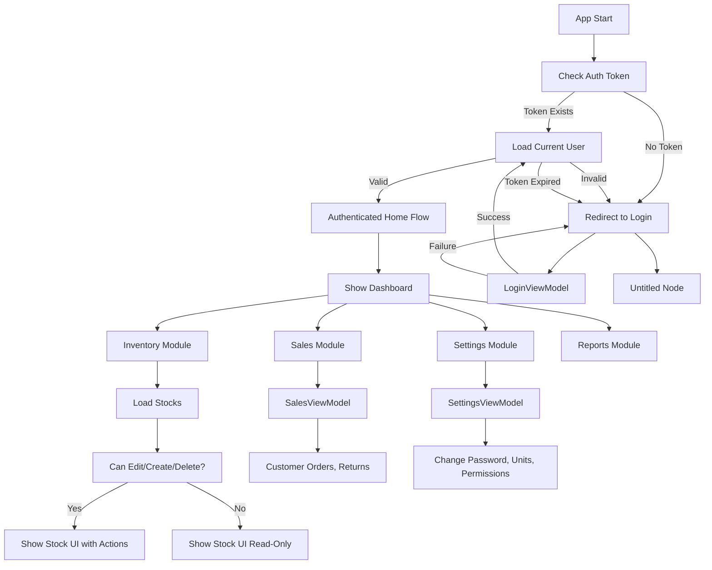

```mermaid
---
config:
  layout: dagre
---
flowchart TD
    A["App Start"] --> B["Check Auth Token"]
    B -- Token Exists --> C["Load Current User"]
    B -- No Token --> F["Redirect to Login"]
    C -- Valid --> D["Authenticated Home Flow"]
    C -- Invalid --> F
    D --> DA["Show Dashboard"]
    DA --> E1["Inventory Module"] & E2["Sales Module"] & E3["Settings Module"] & E4["Reports Module"]
    E1 --> I1["Load Stocks"]
    I1 --> I2["Can Edit/Create/Delete?"]
    I2 -- Yes --> I3["Show Stock UI with Actions"]
    I2 -- No --> I4["Show Stock UI Read-Only"]
    E2 --> S1["SalesViewModel"]
    S1 --> S2["Customer Orders, Returns"]
    E3 --> ST1["SettingsViewModel"]
    ST1 --> ST2["Change Password, Units, Permissions"]
    F --> L1["LoginViewModel"]
    L1 -- Success --> C
    L1 -- Failure --> F
    C -- Token Expired --> F
    F --> n1["Untitled Node"]
    click A "https://docs.flutter.dev/development/ui/overview"
    click L1 "https://riverpod.dev/docs/essentials/providers/"
```
