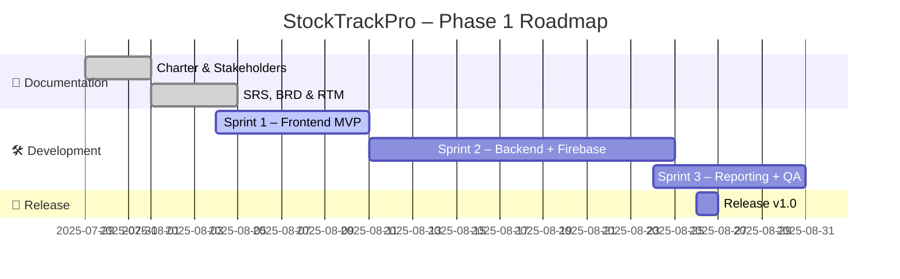
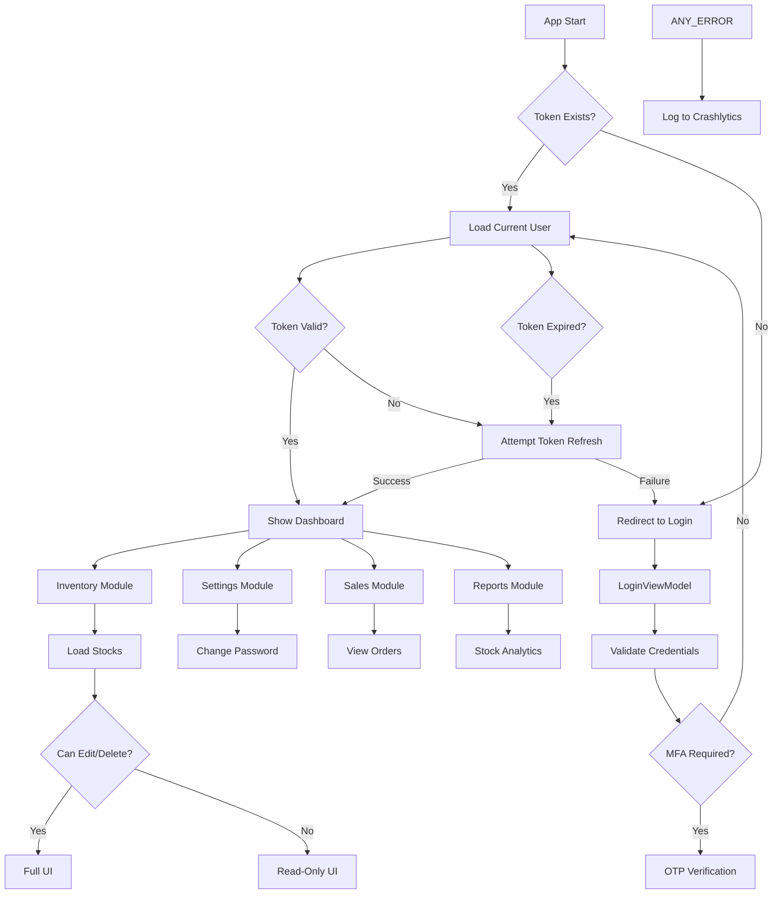

# 📦 StockTrackPro – Stock Management System

**Am'' Technologies** proudly presents **StockTrackPro**, a scalable and modular inventory management solution. Designed with clean architecture principles, this system leverages a **Flutter frontend**, **Spring Boot backend**, and **Firebase integration** to provide seamless stock control, reporting, and role-based access management.

---

## 📁 Phase 1 Documentation

| 📄 Document                                   | Description                                                              | Download                                                                                                                                                                                                   |
| --------------------------------------------- | ------------------------------------------------------------------------ | ---------------------------------------------------------------------------------------------------------------------------------------------------------------------------------------------------------- |
| **Software Requirements Specification (SRS)** | Captures all functional and non-functional system requirements           | [📥 Download](https://github.com/Amarsalim30/StockTrack-Pro/raw/refs/heads/dev/docs/2.Software%20Requirements%20Specification.docx)      |
| **Requirements Traceability Matrix (RTM)**    | Maps requirements to design, test coverage, and current status           | [📥 Download](https://github.com/Amarsalim30/StockTrack-Pro/raw/refs/heads/dev/docs/rtm_stocktrackpro.docx)                                                                   |

---

## 🚀 Project Roadmap

### 🗓️ Phase 1 Timeline



---

## 📌 Sprint 1 Snapshot

```text
Sprint 1 – Frontend MVP
├─ ✅ FR-001: Product Creation (In Progress)
├─ 🟡 FR-002: Product Editing (Ready)
├─ 🧪 FR-004: RBAC Implementation (Testing)
└─ ✅ FR-008: Supplier Management (Complete)
```

---

### 🛠 Tech Stack

* **Frontend:** Flutter (MVVM, Clean Architecture)
* **Backend:** Spring Boot (RESTful APIs)
* **Database:** Firebase Firestore
* **Authentication:** Firebase Auth
* **DevOps:** GitHub Projects (Agile Iterative Board)
* **CI/CD:** GitHub Actions

---



---

> Built with ❤️ by **Am'' Technologies** — *Clarity Engineered™*

---

"# StockTrack-Pro" 
